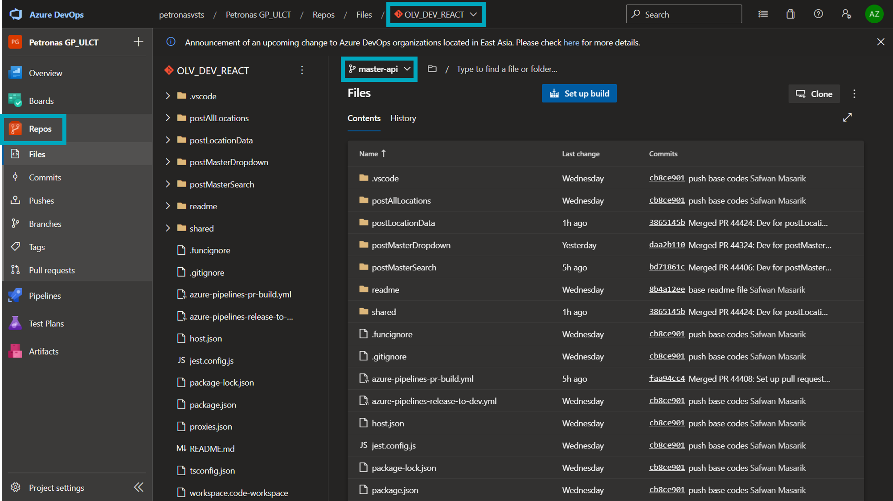
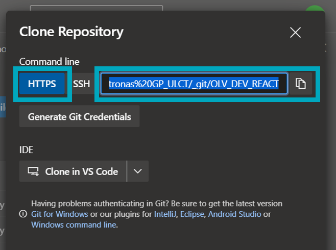
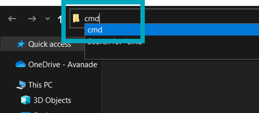
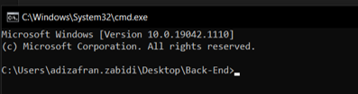

# **About this project**
## Offshore Logistics Venture
Offshore Logistics Venture is a service utilizing rapidly deployable solution which aids day-to-day logistics operation by improving service, optimizing value and enhancing the offshore logistics ecosystem.

The OLV Execute module ingests multiple data streams including GPS data, weather information, and to provide real-time alerts, highlight schedule non-adherence, overlay route plans what-if comparisons and map vessel wise operational KPIs against industry benchmarks for proactive planning.

# **Back-End API Technology**
- Azure Functions  
- Node.js  
- TypeScript
- Microsoft SQL Server  

# **Tools and Software**
- [Visual Studio Code](https://code.visualstudio.com/download)
- [Node.js](https://nodejs.org/en/)
- [Git](https://git-scm.com/)
- [Azure Functions Core Tools](https://docs.microsoft.com/en-us/azure/azure-functions/functions-run-local?tabs=windows%2Ccsharp%2Cbash)
- [Azure Data Studio](https://docs.microsoft.com/en-us/sql/azure-data-studio/download-azure-data-studio?view=sql-server-ver15)
- [SQL Server (for local)](https://www.microsoft.com/en-us/sql-server/sql-server-downloads) -- download *developer* edition
- [SQL Server Management Studio](https://docs.microsoft.com/en-us/sql/ssms/download-sql-server-management-studio-ssms?view=sql-server-ver15)
- [Postman](https://www.postman.com/downloads/)

# **Getting Started**
1) Install all the necessary tools and software mentioned in the previous section.
2) Access [Azure DevOps](https://petronasvsts.visualstudio.com/Petronas%20GP_ULCT) and click on Repos.
3) Begin cloning the repository. Refer to Cloning Repository section.


# **Cloning Repository**
1) Access [Azure DevOps](https://petronasvsts.visualstudio.com/Petronas%20GP_ULCT) and click on **Repos**. Select the **OLV_DEV_REACT** repository and **master-api** branch.
- 

2) Click on **Clone** and copy the **HTTPS** link.
- 

3) Create an empty folder and launch cmd directly via File Explorer.  
- 
- 
- 

4) Input the clone command (**git clone *clone-url***) <br /> `git clone https://petronasvsts.visualstudio.com/Petronas%20GP_ULCT/_git/OLV_DEV_REACT` and hit ***Enter***.  

5) Once the clone process is successful. Go to root of project and open file `workspace.code-workspace`. This will launch the project in Visual Studio Code.

6) Switch to api branch at `master-api branch`.

5) For development, branch out from `master-api branch`. All changes to master-api branch must me done via Pull Request (enforced by policy).


# **Branch Naming Convention**
Example (including work item number is optional)
- `api-features/123-sample-task`
- `api-features/postLocationData`
- `api-hotfix/456-fixing-bug`
- `api-hotfix/postLocationData`

# **Running Local APIs**
1) Create a `local.settings.json` file in the root project directory.
2) Include the content as below:-
```json
{
  "IsEncrypted": false,
  "Values": {
    "AzureWebJobsStorage": "",
    "FUNCTIONS_WORKER_RUNTIME": "node",
    "SQLConnectionString": ""
  }
}
```
3) Update the `SQLConnectionString` with development connection string.
4) Run `npm install`
5) Run `npm run build`
6) Run `func start`

> Note: <br/> 
`npm install` will install package dependencies in `node_modules` folder. 
<br/> `npm run build` wil execute `tsc` which compiles Typescript code to Javascript, to folder `dist`.
# **Running Unit Tests**
1) Run `npm test`

# **Running Debug Mode**
1) Put the breakpoint anywhere in .ts code.
2) To debug Azure Function, run debug for Node function
- 
3) To debug Jest Test, run debug Jest Test
- 

# **Compilation of Useful Commands**
| **Command**                        | **Description**                                          |
| ---------------------------------- | -------------------------------------------------------- |
| npm i                              | Installs Modules and Libraries                           |
| npm audit fix                      | Fixes vulnerabilities/issues with installed packages     |
| npm run-script build               | Transpiles TypeScript to JavaScript for runtime purposes |
| func start                         | Runs Azure Functions                                     |
| npm test                           | Runs Unit Testing with Jest                              |
| npm test ***sample-file.test.js*** | Runs Unit Testing with Jest on a specific file           |
| git fetch                          | Scans for new/updated branches                           |
| git pull origin ***branch-name***  | Pulls code from selected branch                          |
|git clone some-url| Clones the code into your local environment|

