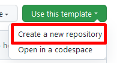
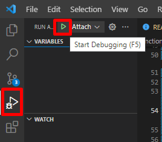
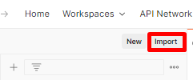
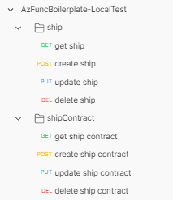
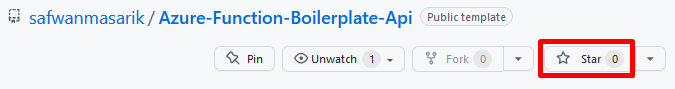

# **Azure Function Node.js Typescript Starter and Boilerplate**

## Goals

The goal of this repository is to provide a feature-rich starting point for any Developer / Team to kick-start their next major project using Azure Function Node.js with Typescript. This also serves as point of reference for learning advanced concepts and implementations.

## Features

This repository is 🔋 battery packed with:

- ⚡️ Azure Function Typescript support
- ♨️ Hot reload capability — auto compile on save and server restart
- 🃏 Jest — Configured for unit testing + mocking db response
- ✨ Linq package — an alternative to lodash, Typescript support for enumerating collections
- 📏 Mssql package — support for local database
- 💨 Json2Typescript package — Modelling json object to Typescript object
- 🤣 Joiful package — Joi for Typescript, validate api parameters with class & @decorators.
- 📈 Typescript project diagnostics enabled — quickly catch error by compiling on background and displaying error in problems bar.
- 📏 Auto format on save
- 🤖 Visual Studio code full support and intellisense.
- 🦠 Microservice architecture — api & database separate repository, no ORM.

## Back-End API Technology

- Azure Functions
- Node.js
- TypeScript
- Microsoft SQL Server

## Detailed documentation of this boilerplate is available here:

- [TODO]()

# **Getting Started**

## Tools and Software

- [Visual Studio Code](https://code.visualstudio.com/download)
- [Node.js](https://nodejs.org/en/)
- [Git](https://git-scm.com/)
- [Azure Functions Core Tools](https://docs.microsoft.com/en-us/azure/azure-functions/functions-run-local?tabs=windows%2Ccsharp%2Cbash)
- [SQL Server (for local)](https://www.microsoft.com/en-us/sql-server/sql-server-downloads) — download _developer_ edition
- [SQL Server Management Studio](https://docs.microsoft.com/en-us/sql/ssms/download-sql-server-management-studio-ssms?view=sql-server-ver15)
- [Postman](https://www.postman.com/downloads/)

> 1. Install all the necessary tools and software mentioned.
> 2. Use this repository as template 😄
>    > .
> 3. Git clone the repository to your machine.

## Install dependencies

1. Please use Visual Studio code for full support.
2. Install the recommended VS Code extensions.

## Setup environment setting

1. In root folder, rename file `local.settings.json.template` to `local.settings.json`.
1. By default, the database response is mocked, hence the API run will be successful even without an actual database.
1. (Database deployment, more details below.) If database is deployed then update the `SQLConnectionString` with development connection string and remove config `MockDbResponse`.

> **Run without debugging**
>
> 1. Run `npm install`
> 1. Run `npm run build`
> 1. Run `func start`

> **Start debugging (recommended mode)**
>
> Click on debug button or press F5.
>
> > .

> Note:   `npm install` will install package dependencies in `node_modules` folder.
>   `npm run build` wil execute `tsc` which compiles Typescript code to Javascript, to folder `dist`.

## Run API locally

1. Open Postman.
2. Import the Postman collection located at folder `postman/AzFuncBoilerplate-LocalTest.postman_collection.json`.
   > 
3. Run API requests 😊.
   > 

## Deploy the database

1. As part of microservice architecture, the database source code is maintained in a separate repository with Visual Studio database project.
1. We will deploy the required database to the desired destination either local machine or Azure using Visual Studio.
1. Follow along the README in this repository https://github.com/safwanmasarik/Azure-Function-Boilerplate-Db.

# **Support** 🤩

Has this Project helped you learn something New? or Helped you at work?
Here are a few ways by which you can support.

- Leave a star! ⭐
  > 
- Recommend this awesome project to your colleagues. 🥇
